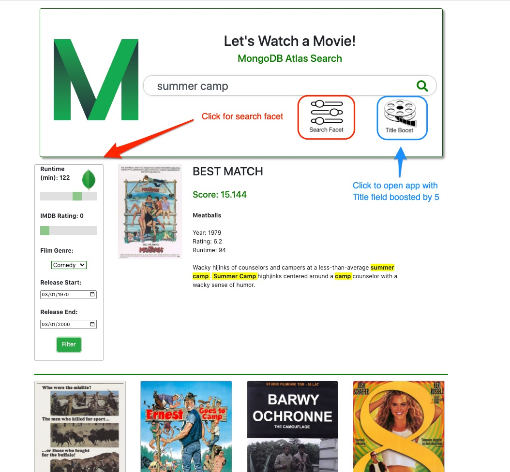

# AtlasSearchMovies
Uses Atlas Search with the sample_mflix.movies collection to find movies based on a topic or title. Uses:
* autocomplete
* fuzzy matching
* boost score modifier for title field
* faceting across dates and numerics.

This application can be found hosted on www.atlassearchmovies.com .
A video walk-through of the application and features is here: https://youtu.be/kZ77X67GUfk

